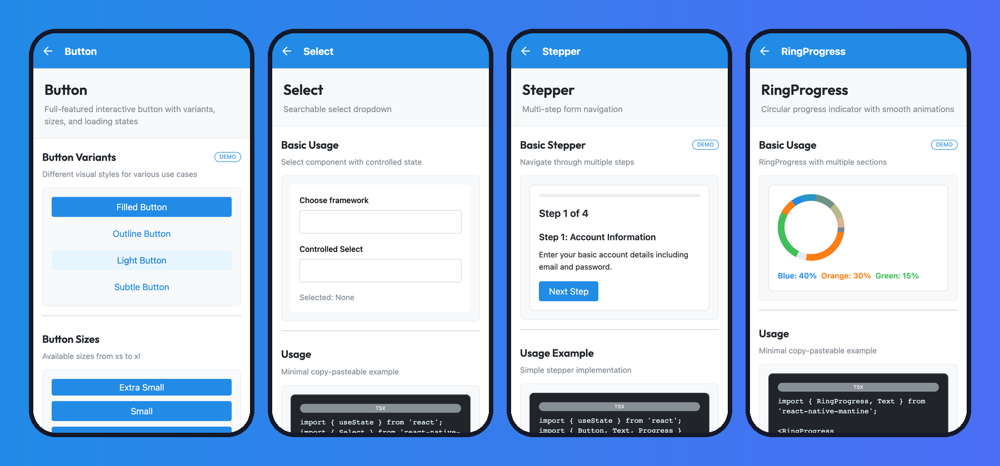

<div align="center">

# React Native Mantine

**Mantine for React Native.** 118 themeable, accessible components for iOS, Android and Web, with the theme system, variants and `useForm` API Mantine users already know.

[](https://www.npmjs.com/package/react-native-mantine)
[](https://www.npmjs.com/package/react-native-mantine)
[](https://github.com/auronsan/react-native-mantine/actions/workflows/ci.yml)
[](https://github.com/auronsan/react-native-mantine/actions/workflows/ci.yml)
[](https://github.com/auronsan/react-native-mantine/blob/main/LICENSE)
[](https://reactnative.dev/)
[](https://expo.dev/)
[](https://www.typescriptlang.org/)

[**Documentation**](https://auronsan.github.io/react-native-mantine/) · [**Try it in Expo Snack**](https://snack.expo.dev/?name=react-native-mantine&description=Mantine+for+React+Native&platform=web&sdkVersion=54.0.0&dependencies=expo-clipboard%40%7E8.0.8%2Cexpo-font%40%7E14.0.10%2Cexpo-linear-gradient%40%7E15.0.8%2Creact-native-mantine%40%5E0.20.0&code=import+%7B+useState+%7D+from+%27react%27%3B%0Aimport+%7B+ScrollView%2C+useColorScheme+%7D+from+%27react-native%27%3B%0Aimport+%7B%0A++Theme%2C%0A++Title%2C%0A++Text%2C%0A++Button%2C%0A++Group%2C%0A++Stack%2C%0A++Card%2C%0A++Badge%2C%0A++Switch%2C%0A++TextInput%2C%0A++Select%2C%0A++Progress%2C%0A++RingProgress%2C%0A++Stepper%2C%0A%7D+from+%27react-native-mantine%27%3B%0A%0Aexport+default+function+App%28%29+%7B%0A++const+system+%3D+useColorScheme%28%29%3B%0A++const+%5Bdark%2C+setDark%5D+%3D+useState%28system+%3D%3D%3D+%27dark%27%29%3B%0A++const+%5Bstep%2C+setStep%5D+%3D+useState%281%29%3B%0A++const+%5Bframework%2C+setFramework%5D+%3D+useState%28null%29%3B%0A%0A++return+%28%0A++++%3CTheme+forceMode%3D%7Bdark+%3F+%27dark%27+%3A+%27light%27%7D%3E%0A++++++%3CScrollView+contentContainerStyle%3D%7B%7B+padding%3A+24%2C+paddingTop%3A+64%2C+gap%3A+24+%7D%7D%3E%0A++++++++%3CGroup+position%3D%22apart%22+align%3D%22center%22%3E%0A++++++++++%3CTitle+order%3D%7B2%7D%3EReact+Native+Mantine%3C%2FTitle%3E%0A++++++++++%3CSwitch+checked%3D%7Bdark%7D+onChange%3D%7BsetDark%7D+label%3D%22Dark%22+%2F%3E%0A++++++++%3C%2FGroup%3E%0A%0A++++++++%3CCard+shadow%3D%22sm%22+p%3D%22lg%22+radius%3D%22md%22+withBorder%3E%0A++++++++++%3CStack+spacing%3D%7B12%7D%3E%0A++++++++++++%3CGroup+position%3D%22apart%22%3E%0A++++++++++++++%3CText+weight%3D%7B600%7D%3EButtons%3C%2FText%3E%0A++++++++++++++%3CBadge+color%3D%22blue%22+variant%3D%22light%22%3E%0A++++++++++++++++8+variants%0A++++++++++++++%3C%2FBadge%3E%0A++++++++++++%3C%2FGroup%3E%0A++++++++++++%3CGroup+spacing%3D%7B8%7D%3E%0A++++++++++++++%3CButton%3EFilled%3C%2FButton%3E%0A++++++++++++++%3CButton+variant%3D%22light%22%3ELight%3C%2FButton%3E%0A++++++++++++++%3CButton+variant%3D%22outline%22%3EOutline%3C%2FButton%3E%0A++++++++++++++%3CButton+variant%3D%22subtle%22%3ESubtle%3C%2FButton%3E%0A++++++++++++%3C%2FGroup%3E%0A++++++++++%3C%2FStack%3E%0A++++++++%3C%2FCard%3E%0A%0A++++++++%3CCard+shadow%3D%22sm%22+p%3D%22lg%22+radius%3D%22md%22+withBorder%3E%0A++++++++++%3CStack+spacing%3D%7B12%7D%3E%0A++++++++++++%3CText+weight%3D%7B600%7D%3EInputs%3C%2FText%3E%0A++++++++++++%3CTextInput+label%3D%22Email%22+placeholder%3D%22you%40example.com%22+%2F%3E%0A++++++++++++%3CSelect%0A++++++++++++++label%3D%22Framework%22%0A++++++++++++++placeholder%3D%22Pick+one%22%0A++++++++++++++data%3D%7B%5B%27Expo%27%2C+%27React+Native+CLI%27%5D%7D%0A++++++++++++++value%3D%7Bframework%7D%0A++++++++++++++onChange%3D%7BsetFramework%7D%0A++++++++++++%2F%3E%0A++++++++++%3C%2FStack%3E%0A++++++++%3C%2FCard%3E%0A%0A++++++++%3CCard+shadow%3D%22sm%22+p%3D%22lg%22+radius%3D%22md%22+withBorder%3E%0A++++++++++%3CStack+spacing%3D%7B12%7D%3E%0A++++++++++++%3CText+weight%3D%7B600%7D%3EProgress%3C%2FText%3E%0A++++++++++++%3CProgress+value%3D%7B65%7D+%2F%3E%0A++++++++++++%3CGroup+position%3D%22center%22%3E%0A++++++++++++++%3CRingProgress%0A++++++++++++++++size%3D%7B120%7D%0A++++++++++++++++sections%3D%7B%5B%0A++++++++++++++++++%7B+value%3A+40%2C+color%3A+%27blue%27+%7D%2C%0A++++++++++++++++++%7B+value%3A+30%2C+color%3A+%27orange%27+%7D%2C%0A++++++++++++++++++%7B+value%3A+15%2C+color%3A+%27green%27+%7D%2C%0A++++++++++++++++%5D%7D%0A++++++++++++++%2F%3E%0A++++++++++++%3C%2FGroup%3E%0A++++++++++%3C%2FStack%3E%0A++++++++%3C%2FCard%3E%0A%0A++++++++%3CCard+shadow%3D%22sm%22+p%3D%22lg%22+radius%3D%22md%22+withBorder%3E%0A++++++++++%3CStack+spacing%3D%7B12%7D%3E%0A++++++++++++%3CText+weight%3D%7B600%7D%3EStepper%3C%2FText%3E%0A++++++++++++%3CStepper+active%3D%7Bstep%7D+onStepClick%3D%7BsetStep%7D%3E%0A++++++++++++++%3CStepper.Step+label%3D%22Account%22+description%3D%22Create+account%22+%2F%3E%0A++++++++++++++%3CStepper.Step+label%3D%22Verify%22+description%3D%22Verify+email%22+%2F%3E%0A++++++++++++++%3CStepper.Step+label%3D%22Done%22+description%3D%22Get+full+access%22+%2F%3E%0A++++++++++++%3C%2FStepper%3E%0A++++++++++++%3CGroup+position%3D%22right%22%3E%0A++++++++++++++%3CButton+variant%3D%22default%22+onPress%3D%7B%28%29+%3D%3E+setStep%28%28s%29+%3D%3E+Math.max%280%2C+s+-+1%29%29%7D%3E%0A++++++++++++++++Back%0A++++++++++++++%3C%2FButton%3E%0A++++++++++++++%3CButton+onPress%3D%7B%28%29+%3D%3E+setStep%28%28s%29+%3D%3E+Math.min%283%2C+s+%2B+1%29%29%7D%3ENext%3C%2FButton%3E%0A++++++++++++%3C%2FGroup%3E%0A++++++++++%3C%2FStack%3E%0A++++++++%3C%2FCard%3E%0A++++++%3C%2FScrollView%3E%0A++++%3C%2FTheme%3E%0A++%29%3B%0A%7D%0A) · [Starter template](https://github.com/auronsan/react-native-mantine-template) · [npm](https://www.npmjs.com/package/react-native-mantine) · [Changelog](CHANGELOG.md) · [llms.txt](https://auronsan.github.io/react-native-mantine/llms.txt)



</div>

## Why React Native Mantine

- **Same mental model as Mantine on web.** Colors, sizes, radius, shadows, variants (`filled`, `light`, `outline`, `subtle`, `gradient`, ...) and `useForm` follow Mantine, so a team with a Mantine web app can share theme tokens and habits with its mobile app.
- **118 components, not 40.** Layout, inputs, overlays, navigation, feedback and data display, plus components most React Native kits skip: `Tree`, `TreeSelect`, `TransferList`, `Splitter`, `Timeline`, `Stepper`, `Marquee`, `RollingNumber`, `TableOfContents`, `RingProgress`, `SemiCircleProgress`.
- **Works everywhere.** iOS, Android and Web through React Native Web. Expo is a first-class target; bare React Native works too.
- **Zero required native dependencies.** Icons, gradients, clipboard and fonts are pluggable and optional. Bring `@expo/vector-icons` or `react-native-vector-icons`, or neither.
- **Typed end to end.** Written in TypeScript with documented props for every component.

## Features

- **118 React Native Components** - Buttons, inputs, overlays, navigation, feedback and data display, all themeable
- **Full Theme System** - 14 color palettes with 10 shades each, aligned with Mantine, with light and dark modes
- **8 Component Variants** - filled, light, outline, subtle, white, default, gradient and transparent
- **TypeScript First** - Comprehensive type definitions for every component and hook
- **Accessibility Built-in** - Components follow React Native accessibility best practices out of the box
- **Expo Compatible** - Works with Expo and bare React Native; native integrations are optional and pluggable
- **Cross-platform** - iOS, Android and Web (via React Native Web)
- **Form Management** - `useForm` hook with validation, error handling and state management

## Production readiness

react-native-mantine is used in production apps and is maintained as a stable library. What that means concretely:

| | |
| --- | --- |
| **Supported React Native** | 0.72 and newer, including the New Architecture (Fabric and TurboModules). The library is pure TypeScript with no native code, so there is nothing to link and nothing that breaks on architecture changes. The showcase runs on Expo SDK 54 with the New Architecture enabled. |
| **Supported React** | 18.2 and 19 |
| **Expo** | SDK 50 and newer, managed or bare. Expo is not required. |
| **Web** | React Native Web 0.19 and newer |
| **Runtime dependencies** | None. Every native integration (icons, gradients, clipboard, document picker, fonts) is an optional adapter you choose. |
| **Package** | ESM and CommonJS builds, `sideEffects: false` for tree shaking, TypeScript declarations for every export |
| **Tests** | 1,900+ tests across every component and hook, 99% statement and 85% branch coverage, with a 95% / 80% threshold enforced in CI; CI runs typecheck, lint, tests and the build on every commit and pull request |
| **Accessibility** | Interactive components ship `accessibilityRole`, `accessibilityState`, `accessibilityValue` and derived labels, and always let you override them |
| **Versioning** | Semantic versioning with Conventional Commits. Breaking changes only in a major release, announced in [CHANGELOG.md](CHANGELOG.md) with a migration note. Deprecated props keep working for at least one minor release and warn in development. |
| **Security** | Dependabot enabled, transitive advisories pinned, private reporting via [SECURITY.md](SECURITY.md) |
| **License** | MIT |

If you hit something that blocks a production rollout, [open an issue](https://github.com/auronsan/react-native-mantine/issues/new/choose). Blocking bugs are treated as the top priority.

## Installation

```bash
npm install react-native-mantine
```

Or with Yarn:

```bash
yarn add react-native-mantine
```

### Peer Dependencies

Only `react` and `react-native` are required. Everything else is optional and pluggable.

```bash
npm install react react-native
```

## Icons and native integrations

react-native-mantine does not depend on any icon, gradient or SVG package. Pass the implementations you already use through `Theme` / `ThemeProvider`, or through `configureMantine` outside React. When nothing is passed, the library uses `react-native-vector-icons`, `expo-linear-gradient`, `expo-clipboard`, `expo-document-picker`, `expo-font` and `react-native-svg` if they happen to be installed, and otherwise degrades gracefully: icon names render as text, gradients render as a solid first color, and `RingProgress` draws its ring from Views instead of SVG arcs.

### Expo

```bash
npx expo install @expo/vector-icons expo-linear-gradient
```

```tsx
import FontAwesome from '@expo/vector-icons/FontAwesome';
import { LinearGradient } from 'expo-linear-gradient';
import { Theme, type MantineAdapters } from 'react-native-mantine';

const adapters: Partial<MantineAdapters> = {
  Icon: FontAwesome as MantineAdapters['Icon'], // Expo types `name` as a glyph union
  LinearGradient,
};

export default function App() {
  return <Theme adapters={adapters}>{/* your app */}</Theme>;
}
```

### Bare React Native

```bash
yarn add react-native-vector-icons react-native-linear-gradient
cd ios && pod install
```

```tsx
import FontAwesome from 'react-native-vector-icons/FontAwesome';
import LinearGradient from 'react-native-linear-gradient';
import { Theme } from 'react-native-mantine';

export default function App() {
  return <Theme adapters={{ Icon: FontAwesome, LinearGradient }}>{/* your app */}</Theme>;
}
```

### Outside React

```ts
import { configureMantine } from 'react-native-mantine';

configureMantine({ Icon: FontAwesome, LinearGradient }); // e.g. in index.js
```

`Theme adapters` takes precedence over `configureMantine`.

### Other adapters

| Adapter          | Used by                   | Shape                                                    | Default fallback       |
| ---------------- | ------------------------- | -------------------------------------------------------- | ---------------------- |
| `clipboard`      | `CopyButton`              | `{ setStringAsync(text) }`                               | `expo-clipboard`       |
| `documentPicker` | `FileButton`, `FileInput` | `(opts) => Promise<{ canceled, assets }>` (Expo shape)   | `expo-document-picker` |
| `loadFonts`      | `Theme`                   | `(fonts) => Promise<void>`                               | `expo-font`            |
| `svg`            | `RingProgress`            | `{ Svg, Circle }`                                        | `react-native-svg`     |

```ts
import Clipboard from '@react-native-clipboard/clipboard';

configureMantine({
  clipboard: { setStringAsync: (text) => Clipboard.setString(text) },
});
```

## Quick Start

Wrap your application with `ThemeProvider` at the root level:

```tsx
import { ThemeProvider, Button, Text, Stack, Paper } from 'react-native-mantine';

export default function App() {
  return (
    <ThemeProvider>
      <Stack spacing="md">
        <Paper padding="lg" shadow="sm">
          <Text size="xl" weight={700}>
            Welcome to React Native Mantine
          </Text>
          <Text color="dimmed">
            Build beautiful mobile apps with ease
          </Text>
        </Paper>
        <Button variant="filled" color="blue" onPress={() => console.log('Pressed!')}>
          Get Started
        </Button>
      </Stack>
    </ThemeProvider>
  );
}
```

## Components

React Native Mantine includes 110+ components organized by category:

### Layout Components

- **BoxView** - Base layout component with theme-aware styling
- **Container** - Responsive container with max-width constraints
- **Center** - Centers children horizontally and vertically
- **Flex** - Flexbox layout with gap support
- **Group** - Horizontal layout with spacing
- **Stack** - Vertical layout with spacing
- **Grid** - Responsive grid system
- **SimpleGrid** - Equal-width grid columns
- **Space** - Add spacing between elements
- **AspectRatio** - Maintain aspect ratio for child elements
- **MediaQuery** - Responsive components based on screen size
- **AppShell** - Application shell with header, navbar, aside and footer
- **Splitter** - Resizable panes divided by draggable handles

### Typography

- **Text** - Themeable text component with size variants
- **Title** - Heading component (h1-h6)
- **Highlight** - Highlight text segments
- **Mark** - Mark/highlight text with background color
- **Code** - Inline code display
- **Blockquote** - Styled quotation blocks
- **Kbd** - Keyboard key display
- **Table** - Data table component
- **Typography** - Applies consistent typography styles to nested content

### Buttons

- **Button** - Primary button with variants and loading states
- **UnstyledButton** - Unstyled pressable base
- **ActionIcon** - Icon button with variants
- **CloseButton** - Close/dismiss button
- **CopyButton** - Copy to clipboard button
- **FileButton** - Button that opens the document picker
- **Burger** - Animated hamburger menu button

### Inputs

- **TextInput** - Text input with variants and error states
- **Textarea** - Multiline text input
- **PasswordInput** - Password input with show/hide toggle
- **NumberInput** - Numeric input with increment/decrement
- **PinInput** - PIN code input
- **Switch** - Toggle switch
- **Checkbox** - Checkbox input
- **Radio** - Radio button input
- **Chip** - Selectable chip
- **Slider** - Range slider input
- **Select** - Dropdown select
- **MultiSelect** - Multiple selection dropdown
- **Autocomplete** - Autocomplete input
- **NativeSelect** - Native platform select
- **Fieldset** - Groups related inputs with a legend
- **InputBase** - Base input frame for building custom inputs
- **JsonInput** - JSON input with validation and formatting
- **MaskInput** - Input with masked value formatting
- **ColorInput** - Color input with picker bottom sheet
- **ColorPicker** - Color picker with saturation, hue and alpha controls
- **FileInput** - File picking input built on the document picker
- **PillsInput** - Input that renders pills inside its frame
- **TagsInput** - Input for entering multiple tags
- **AngleSlider** - Circular slider for selecting angles
- **TreeSelect** - Select input with hierarchical options
- **Combobox** - Building blocks for custom select components

### Data Display

- **Paper** - Card-like surface with shadow and padding
- **Badge** - Status badges with variants
- **Avatar** - User avatar with image/initials
- **Card** - Content card with sections
- **Timeline** - Timeline/stepper display
- **List** - Ordered/unordered lists
- **Divider** - Visual separator
- **Progress** - Progress bar
- **RingProgress** - Circular progress indicator
- **Skeleton** - Loading skeleton placeholder
- **ColorSwatch** - Color display component
- **ThemeIcon** - Icon with theme colors
- **Indicator** - Badge indicator overlay
- **Breadcrumbs** - Navigation breadcrumbs
- **Pill** - Removable tag/pill element
- **NumberFormatter** - Formats numbers with separators, prefix and suffix
- **SemiCircleProgress** - Semi-circular progress indicator
- **RollingNumber** - Animated rolling number display
- **DataList** - Key-value data list
- **EmptyState** - Placeholder for empty content areas
- **Tree** - Hierarchical tree view
- **OverflowList** - List that collapses overflowing items

### Overlay Components

- **Overlay** - Backdrop overlay
- **Modal** - Full-featured modal dialog
- **Drawer** - Slide-in drawer from edges
- **Dialog** - Simple dialog box
- **Popover** - Popover with positioning
- **Menu** - Dropdown menu
- **Tooltip** - Hover/press tooltip
- **LoadingOverlay** - Full-screen loading overlay
- **HoverCard** - Dropdown card opened from a target element
- **Affix** - Positions content at fixed screen coordinates
- **Portal** - Renders children into an overlay host
- **FloatingWindow** - Draggable floating window
- **FloatingIndicator** - Indicator that follows its target element

### Feedback

- **Notification** - Toast notification
- **Alert** - Alert banner with variants
- **Loader** - Loading spinner

### Navigation

- **Tabs** - Tab navigation
- **Pagination** - Page pagination
- **Stepper** - Multi-step navigation
- **SegmentedControl** - Segmented control buttons
- **NavLink** - Navigation link component
- **Anchor** - Link component
- **TableOfContents** - List of section links with depth offsets
- **Menubar** - Horizontal bar of menus

### Miscellaneous

- **Accordion** - Collapsible content panels
- **Collapse** - Show/hide content with animation
- **Spoiler** - Show more/less content
- **Rating** - Star rating input
- **TransferList** - Dual list transfer
- **Icon** - Icon component wrapper
- **Image** - Image with fallback
- **BackgroundImage** - Background image container
- **Gradient** - Gradient background
- **LinearGradient** - Linear gradient component
- **Transition** - Animation transition wrapper
- **VisuallyHidden** - Hides content visually while keeping it accessible
- **ScrollArea** - Scrollable area with Mantine-compatible API
- **Scroller** - Horizontal scroller with controls and edge gradients
- **Marquee** - Continuously scrolling content

## Theming

### Typography

The default theme matches mantine.dev:

| Role | Font | Weight |
| --- | --- | --- |
| Body text, inputs, buttons | Platform system font (San Francisco on iOS, Roboto on Android, Mantine's `-apple-system` stack on web) | 400, buttons 600 |
| Headings (`Title`) | [Outfit](https://fonts.google.com/specimen/Outfit), bundled with the library under the SIL Open Font License | 600 |
| Monospace (`Code`, `Kbd`) | Menlo on iOS, `monospace` on Android, Mantine's `ui-monospace` stack on web | 400 |

`Theme` registers the bundled Outfit files through `expo-font` or your `loadFonts` adapter. If neither is available, or when you use `ThemeProvider` directly, headings fall back to the bold system font. To use your own fonts, load them yourself and override `fontFamily`, `fontFamilyBold`, `fontFamilySemiBold`, `fontFamilyInput`, `fontFamilyMonospace`, or `headings.fontFamily` in the theme.

### Creating a Custom Theme

Use `createTheme()` to customize the default theme:

```tsx
import { ThemeProvider, createTheme } from 'react-native-mantine';

const theme = createTheme({
  primaryColor: 'teal',
  primaryShade: { light: 6, dark: 8 },
  fontFamily: 'Inter',
  colors: {
    brand: [
      '#e6f7ff',
      '#bae7ff',
      '#91d5ff',
      '#69c0ff',
      '#40a9ff',
      '#1890ff',
      '#096dd9',
      '#0050b3',
      '#003a8c',
      '#002766',
    ],
  },
});

export default function App() {
  return (
    <ThemeProvider theme={theme}>
      {/* Your app components */}
    </ThemeProvider>
  );
}
```

### Available Theme Properties

```tsx
const theme = createTheme({
  // Primary color from available colors
  primaryColor: 'blue',

  // Primary shade for light and dark modes
  primaryShade: { light: 6, dark: 8 },

  // Typography
  fontFamily: 'System',
  fontFamilyMonospace: 'Courier',

  // Custom colors (10 shades each)
  colors: {
    brand: [...], // Array of 10 color shades
  },

  // Spacing scale
  spacing: {
    xs: 10,
    sm: 12,
    md: 16,
    lg: 20,
    xl: 24,
  },

  // Border radius scale
  radius: {
    xs: 2,
    sm: 4,
    md: 8,
    lg: 16,
    xl: 32,
  },

  // Font sizes
  fontSizes: {
    xs: 12,
    sm: 14,
    md: 16,
    lg: 18,
    xl: 20,
  },

  // Headings configuration
  headings: {
    fontFamily: 'System',
    sizes: {
      h1: { fontSize: 34, lineHeight: 1.3 },
      h2: { fontSize: 28, lineHeight: 1.35 },
      h3: { fontSize: 22, lineHeight: 1.4 },
      h4: { fontSize: 18, lineHeight: 1.45 },
      h5: { fontSize: 16, lineHeight: 1.5 },
      h6: { fontSize: 14, lineHeight: 1.5 },
    },
  },
});
```

### Default Color Palette

React Native Mantine includes 14 color palettes, each with 10 shades:

- **dark** - Grays and blacks
- **gray** - Gray shades
- **red** - Red spectrum
- **pink** - Pink spectrum
- **grape** - Purple/grape spectrum
- **violet** - Violet spectrum
- **indigo** - Indigo spectrum
- **blue** - Blue spectrum
- **cyan** - Cyan spectrum
- **teal** - Teal spectrum
- **green** - Green spectrum
- **lime** - Lime spectrum
- **yellow** - Yellow spectrum
- **orange** - Orange spectrum

### Dark Mode

Enable dark mode by setting `forceMode` prop or using the theme's `toggleMode` function:

```tsx
// Force dark mode
<ThemeProvider forceMode="dark">
  {children}
</ThemeProvider>

// Or toggle programmatically
import { useTheme } from 'react-native-mantine';

function MyComponent() {
  const theme = useTheme();

  return (
    <Button onPress={theme.toggleMode}>
      Toggle {theme.colorScheme === 'light' ? 'Dark' : 'Light'} Mode
    </Button>
  );
}
```

## Hooks

React Native Mantine provides powerful hooks for form management and resource loading:

### useForm

Comprehensive form state management with validation, error handling, and field tracking:

```tsx
import { useForm } from 'react-native-mantine';

function LoginForm() {
  const form = useForm({
    initialValues: {
      email: '',
      password: '',
      terms: false,
    },

    validate: {
      email: (value) =>
        /^\S+@\S+$/.test(value) ? null : 'Invalid email',
      password: (value) =>
        value.length >= 6 ? null : 'Password must be at least 6 characters',
      terms: (value) =>
        value ? null : 'You must accept terms and conditions',
    },

    validateInputOnChange: false,
    validateInputOnBlur: true,
    clearInputErrorOnChange: true,
  });

  return (
    <Stack>
      <TextInput
        label="Email"
        placeholder="your@email.com"
        {...form.getInputProps('email')}
      />

      <PasswordInput
        label="Password"
        placeholder="Your password"
        {...form.getInputProps('password')}
      />

      <Checkbox
        label="I accept terms and conditions"
        checked={form.values.terms}
        onValueChange={(checked) => form.setFieldValue('terms', checked)}
        error={form.errors.terms}
      />

      <Button
        onPress={form.onSubmit((values) => {
          console.log('Form submitted:', values);
        })}
      >
        Submit
      </Button>
    </Stack>
  );
}
```

### useForm API

**Form State:**
- `values` - Current form values
- `errors` - Form validation errors
- `touched` - Fields that have been focused
- `dirty` - Fields that have been modified

**Field Management:**
- `setFieldValue(field, value)` - Update a single field
- `setValues(values)` - Update multiple fields
- `setFieldError(field, error)` - Set field error
- `setErrors(errors)` - Set multiple errors
- `clearFieldError(field)` - Clear field error
- `clearErrors()` - Clear all errors

**Validation:**
- `validateField(field)` - Validate single field
- `validate()` - Validate entire form
- `isValid(field?)` - Check if field/form is valid
- `getFieldStatus(field)` - Get field status (error, touched, dirty)

**Form Actions:**
- `reset()` - Reset form to initial values
- `isDirty()` - Check if form has been modified
- `getInputProps(field)` - Get props for input component
- `onSubmit(handler)` - Handle form submission
- `setFieldTouched(field)` - Mark field as touched

### useTheme

Access the current theme object:

```tsx
import { useTheme } from 'react-native-mantine';

function MyComponent() {
  const theme = useTheme();

  return (
    <View style={{ backgroundColor: theme.colors.blue[6] }}>
      <Text style={{ color: theme.white }}>
        Current mode: {theme.colorScheme}
      </Text>
    </View>
  );
}
```

### useCachedResources

Handles font loading and resource initialization (used internally by ThemeProvider).

## Accessibility

React Native Mantine components are built with accessibility in mind:

- All interactive components include appropriate `accessibilityRole` props
- Form inputs support `accessibilityLabel` and `accessibilityHint`
- Error states are announced to screen readers
- Touch targets meet minimum size requirements (44x44 points)
- Color contrast ratios meet WCAG AA standards
- Keyboard navigation support on web platform

## Expo Compatibility

React Native Mantine works in Expo (managed and bare) and in plain React Native projects. No Expo package is required. See [Icons and native integrations](#icons-and-native-integrations) for how to plug in `@expo/vector-icons`, `expo-linear-gradient`, `expo-clipboard`, `expo-document-picker` and `expo-font`, or their bare React Native equivalents.

## Platform Support

- **iOS** - 13.0 and above
- **Android** - API 21 (Android 5.0) and above
- **React Native** - 0.70 and above
- **Web** (via React Native Web) - Latest versions of Chrome, Firefox, Safari, and Edge

## Contributing

We welcome contributions! Here's how you can help:

1. **Fork the repository** and create your branch from `main`
2. **Install dependencies** - `yarn install`
3. **Make your changes** - Follow the existing code style
4. **Add tests** - Ensure your code is tested
5. **Run tests** - `yarn test`
6. **Check types** - `yarn typecheck`
7. **Lint your code** - `yarn lint`
8. **Submit a pull request**

### Development Commands

```bash
# Install dependencies
yarn install

# Run example app
yarn example start
yarn example ios
yarn example android

# Testing
yarn test              # Run all tests
yarn typecheck         # Type checking
yarn lint              # Lint code

# Building
yarn prepare           # Build library
yarn clean             # Clean build artifacts
```

### Project Structure

```
react-native-mantine/
├── src/
│   ├── components/    # Component implementations
│   ├── theme/         # Theme system
│   ├── hooks/         # Custom hooks
│   └── index.tsx      # Main exports
├── example/           # Example app
└── lib/              # Build output
```

For more details, see [CONTRIBUTING.md](CONTRIBUTING.md).

## Credits

This library is inspired by the excellent [Mantine](https://mantine.dev/) project by Vitaly Rtishchev. Special thanks to the Mantine team for creating such a wonderful UI library that serves as the foundation for this React Native adaptation.

## Community & Support

- **GitHub Issues** - [Report bugs or request features](https://github.com/auronsan/react-native-mantine/issues)
- **GitHub Discussions** - [Ask questions and get community support](https://github.com/auronsan/react-native-mantine/discussions)
- **Documentation** - [Full documentation and demos](https://auronsan.github.io/react-native-mantine/)

## License

MIT License - see the [LICENSE](LICENSE) file for details.

---

Made with care by [Auronsan](https://github.com/auronsan)
